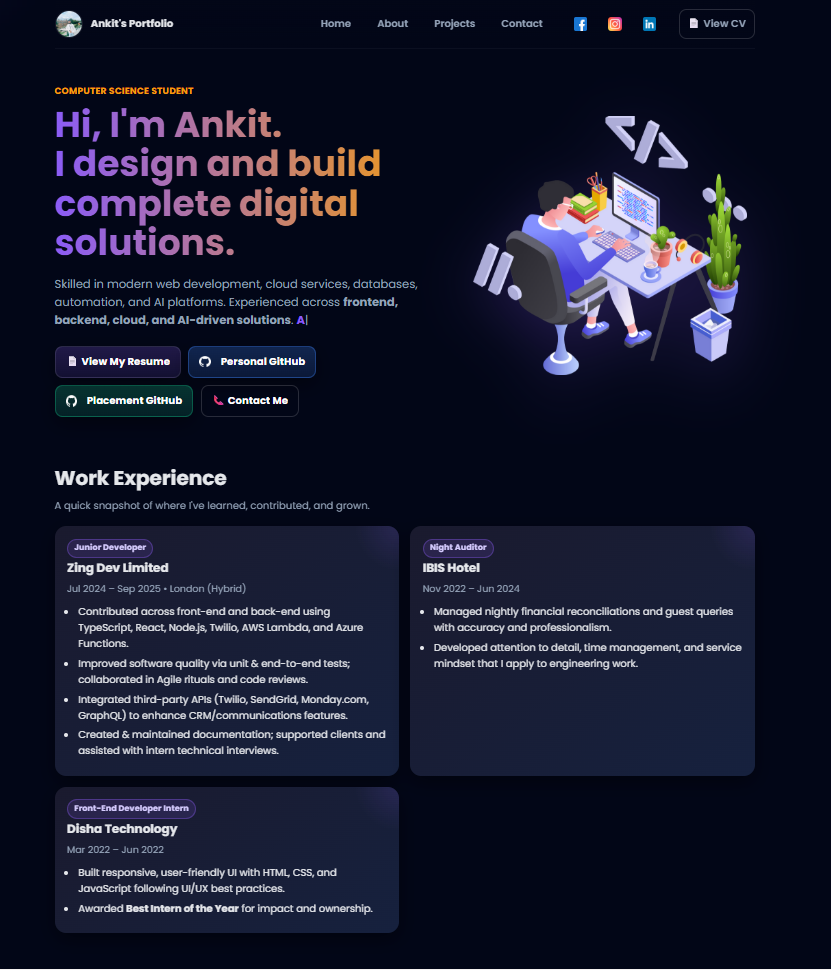
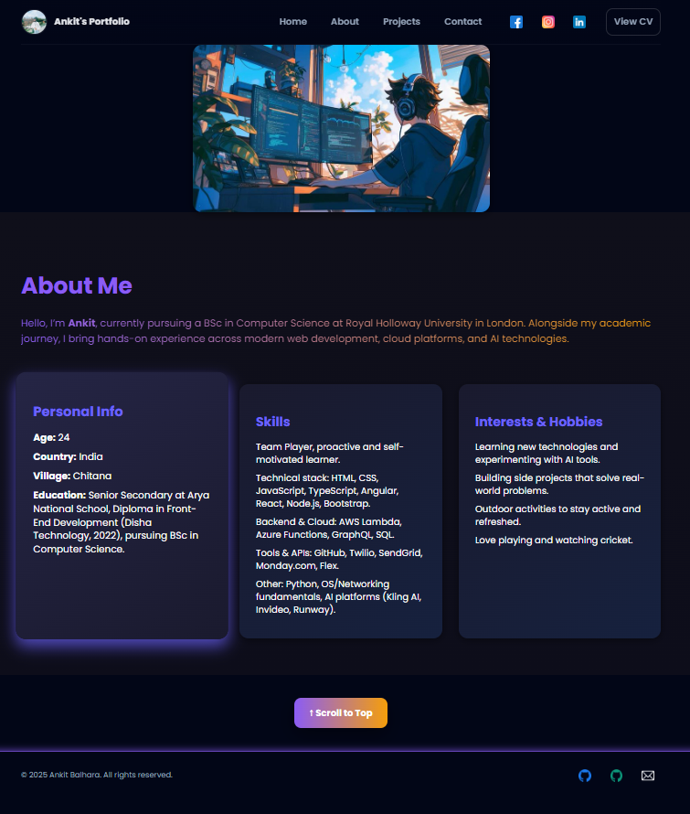
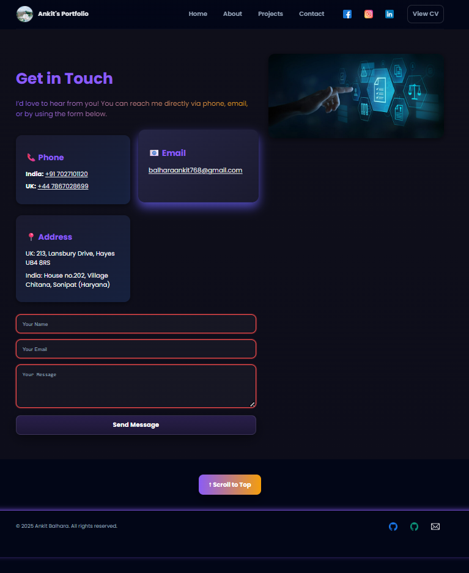

# 🌐 Personal Portfolio Website  

A modern, fully responsive personal portfolio built with **HTML, CSS, and JavaScript**.  
This project showcases my skills, projects, and experiences with a recruiter-friendly, polished design.  

---

## ✨ Features  

- **Responsive Design**  
  Works seamlessly across desktops, tablets, and mobile devices.  

- **Dynamic Navbar**  
  Sticky header with smooth shadow effect on scroll and a mobile-friendly toggle menu.  

- **Animated Hero Section**  
  Typing effect (`Typed.js`) to highlight personal introduction.  

- **Project Showcase**  
  - Filter projects by category and tags.  
  - Dedicated project modals with **image galleries** and descriptions.  
  - GitHub buttons for recruiters to view source code directly.  

- **About & Experience Cards**  
  Interactive cards with modal expansion for more details.  

- **Contact Page**  
  - Contact form with validation and user-friendly error messages.  
  - Social links and GitHub buttons.  

- **Accessibility & UX Enhancements**  
  - Reveal-on-scroll animations using Intersection Observer.  
  - Keyboard navigation support for modals and galleries.  
  - ARIA labels and focus states.  

- **Footer**  
  Dynamic year auto-updates + GitHub buttons for personal and placement repos.  

---

## 🛠️ Tech Stack  

- **Frontend:** HTML5, CSS3, JavaScript (ES6)  
- **Styling:** Custom CSS (with variables & global theming)  
- **Libraries:**  
  - [Typed.js](https://mattboldt.com/demos/typed-js/) for typing effect  
- **Tools:** Git, GitHub  

---

## 📂 Project Structure  

```bash
Portfolio/
├── index.html          # Homepage
├── about.html          # About page
├── contact.html        # Contact page
├── projects.html       # Projects showcase
├── assets/             # Images, icons, logos
├── css/
│   ├── global.css      # Global styles & theme variables
│   ├── index.css       # Homepage-specific styles
│   ├── about.css       # About page styles
│   ├── contact.css     # Contact page styles
│   └── projects.css    # Projects showcase styles
├── js/
│   ├── main.js         # Common scripts for all pages
│   ├── index.js        # Homepage specific scripts
│   ├── about.js        # About page interactions
│   ├── contact.js      # Contact form validation & modals
│   └── projects.js     # Filtering, modals, gallery for projects
└── README.md

🚀 Getting Started
Clone the repo
git clone https://github.com/your-username/portfolio.git
cd portfolio

Open in browser

Just open index.html in your favorite browser.

### 🏠 Home Page  
  

### 🙋 About Page  
  

### 📂 Projects Showcase  
  

### 📬 Contact Form  
  

🔮 Future Enhancements

Dark/Light mode toggle

Blog integration (e.g., coding blog project)

Deployment to GitHub Pages / Netlify

📬 Contact

👨‍💻Name: Ankit 

Portfolio: https://balharaankit.github.io/AnkitPortfolio/

LinkedIn: https://www.linkedin.com/in/ankit-balhara-8013b8228/

GitHub: https://github.com/BalharaAnkit
